# Day 1 - Introduction

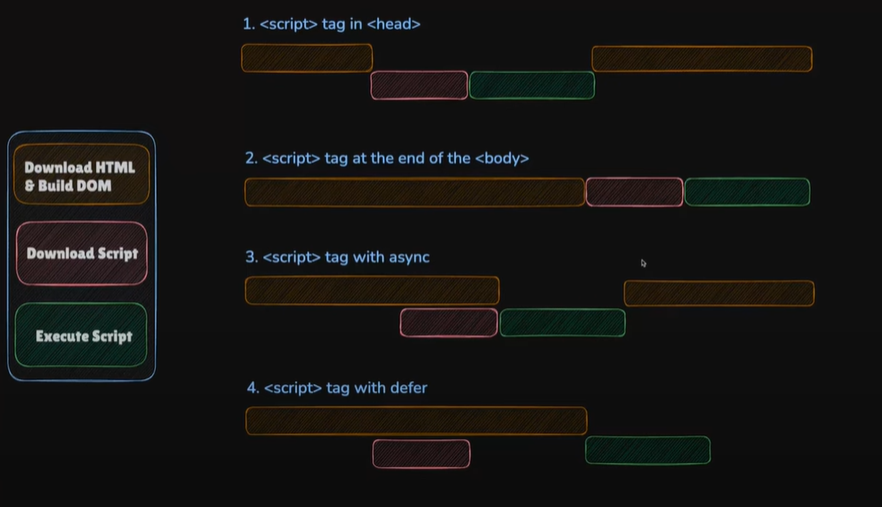

Use JS in html
- Script tag preferred with js file

Browser downloads and executes html and prepares DOM, then downloads scripts and then executes the script. If script gets downloaded fast and html execution is still in progress, we get errors as we might not have reach the declarations in html.

Ex - script tag is in head which performs an activity on a variable

HTML execution is in progress while script execution starts but it fails as it could not find the variable during execution by the browser.

For this we add script tag at the end of body in html or we can use async (used for third party libraries which needs to be download on the background) which will solve the issue but not completely  and then defer which will wait to execute the js only after the html executes all the lines.

# Day 2 - Variables

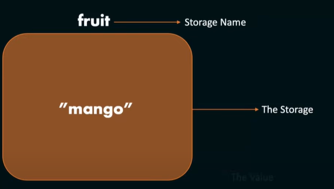

specifiers - control the scope of variables and how many times it can be changed. 

let

const

let/const storage_name = value

let fruit = "mango"

= assignment operator

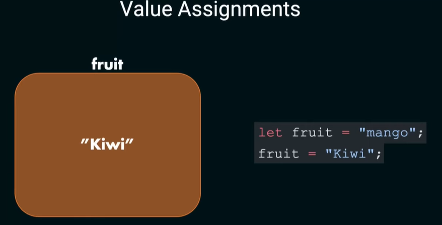

reassign variable has the new value

Value Assignment

Pass by value
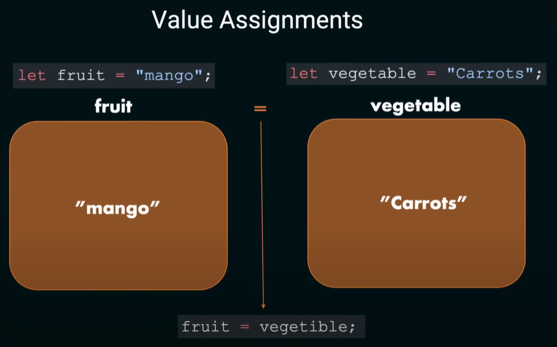

Primitive (pass by value) data types - num, string, boolean, undefined, null, BigInt, Symbol

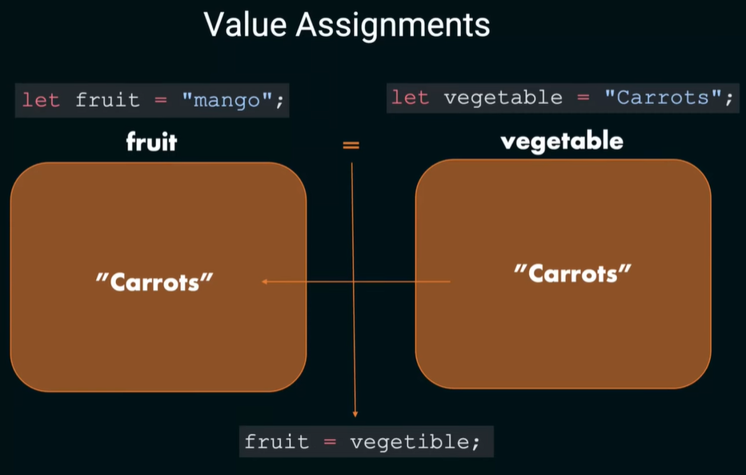

Non-primitive data types - function, array, object

Rules for naming variables -

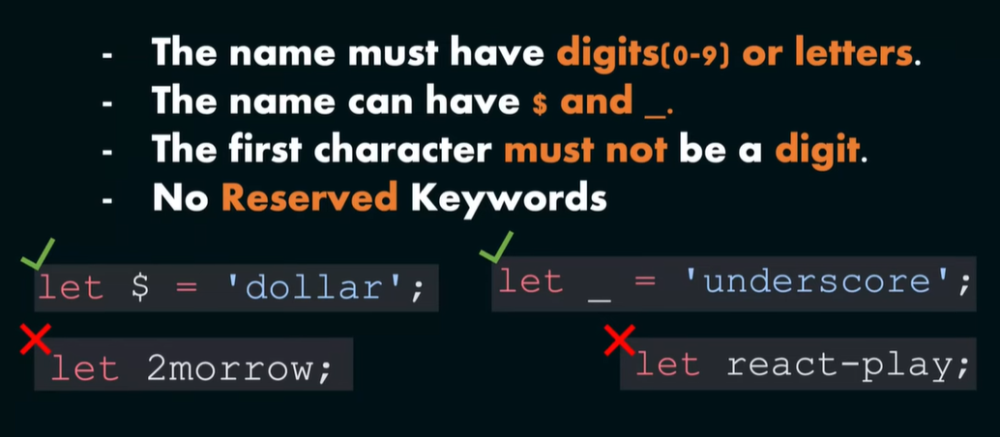

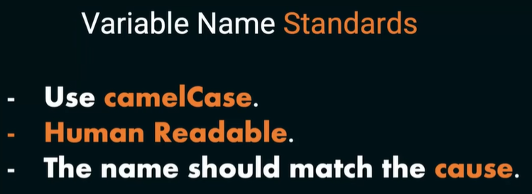

var: Function-scoped, can be redeclared (not recommended)

let: Block-scoped, can be reassigned and cannot be redeclared

const: Block-scoped, cannot be reassigned

Declare variables only once and assign value multiple times based on use case.

Primitive variables are stored in stack and non-primitive in heap. Each location has an address with with the item in stack can get the value from heap by pointing to the address. 

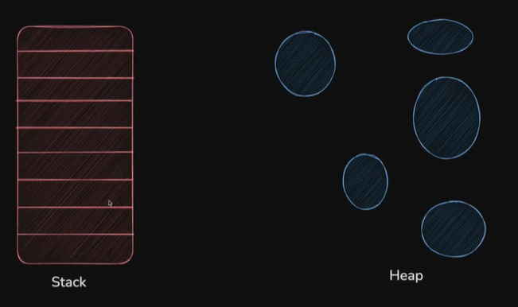

JS performs the following for each line of code -

- Tokenizing - Break line in to pieces/tokens to validate grammar of JS. 
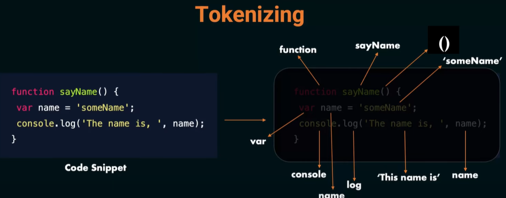

- Parsing - Tree structure with Abstract syntax tree with all the tokens where in each node tokens will be there and definitions
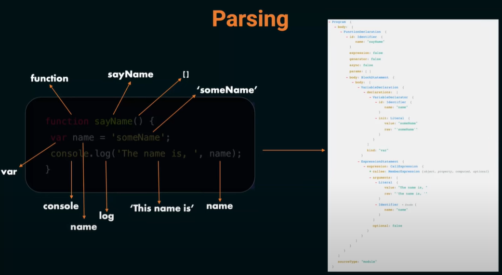

- Interpreting - Machine learning code

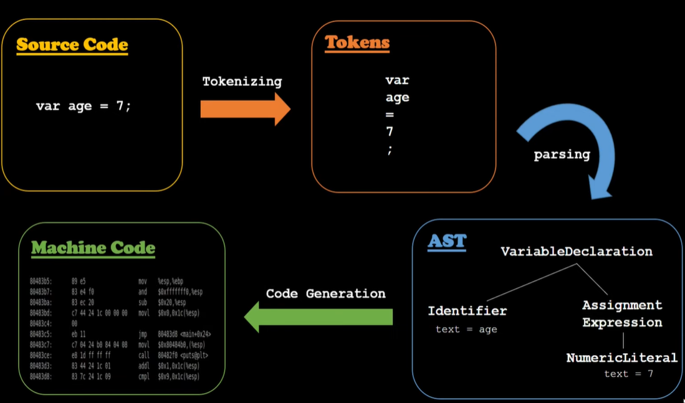

Everything we write in JS gets converted to AST.

# Day 3 - Logic building first steps - Operators and Expressions

// Operator - + - * / % ++ --

// Comparison Operator - == (only checks value) === (strict equality - checks type) != !== > < >= <=

// Logical Operator - && || !

// Bitwise Operator - & | ^ ~ << >> >>>

// Ternary Operator - condition ? true : false

// Assignment Operator - = += -= *= /= %=

// String Operator - +, +=

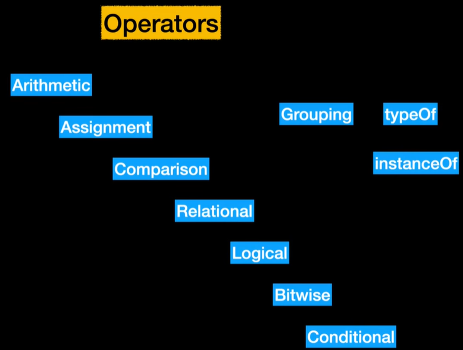

coalescing operator - first value is returned if it is not null or undefined, else second value is returned

Bitwise Operator

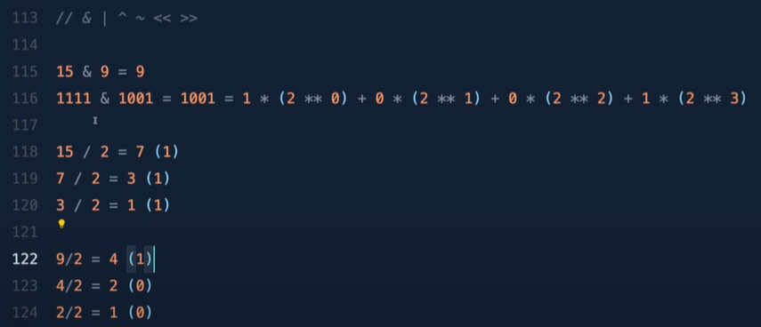

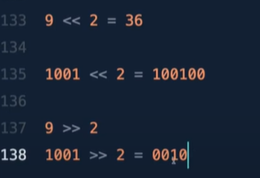

Relational Operator - in, instanceof

Grouping - takes higher precedence in BODMAS

console.log((p + q) * r)

typeof - returns the data type in JS

# Day 4 - Control flow in JS

Control flow of execution rather than line by line. We needto control the flow by using if, if-else, switch-case, break, continue

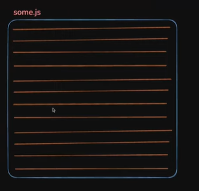

if-else is not suitable for more cases and we use switch case for multiple cases.

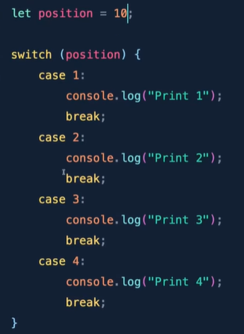

above - no case matches, hence use default

default:
    console.log("Nothing is matched")

If-else is sequential but in switch JS forms a table and directly goes to the matching case. So, it is performance efficient.

complex logical conditions - If-else is the way and if some basic matches to be done its switch case

Ternary case - 
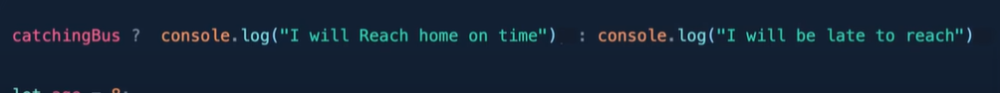

Example
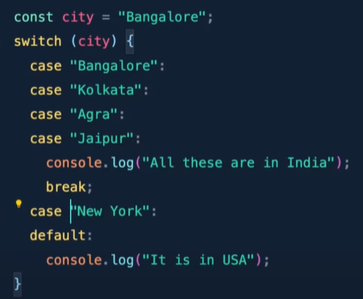

Answer is - All these are in India and then break gets executed

# Day 5 - Loops and Iterations in JS

for, break, continue, while (do not kow in advance how many timesloop will execute)

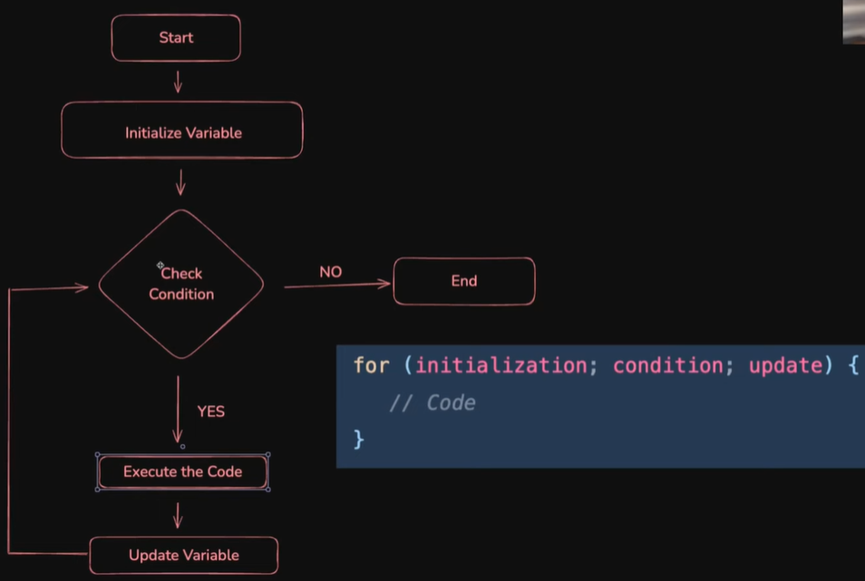

Single dimension - 1D for loop

Multi dimension - ND (Nested loop)

break and continue - break breaks a loop and continue moves to the next by skipping current execution

While
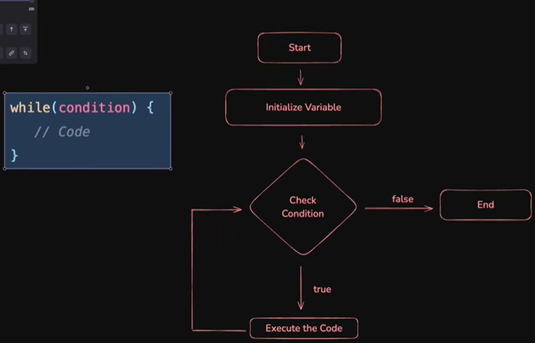

do-while
loop runs atleast once before doing condition check

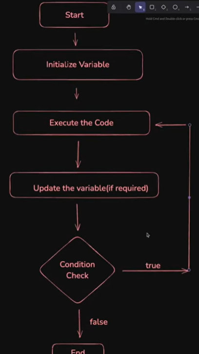

Infinite loop - avoid this as this never terminates
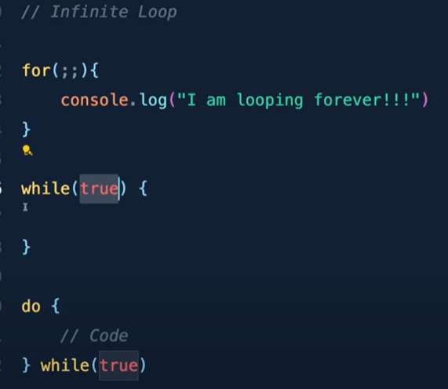

# Day 6 - Functions in JS

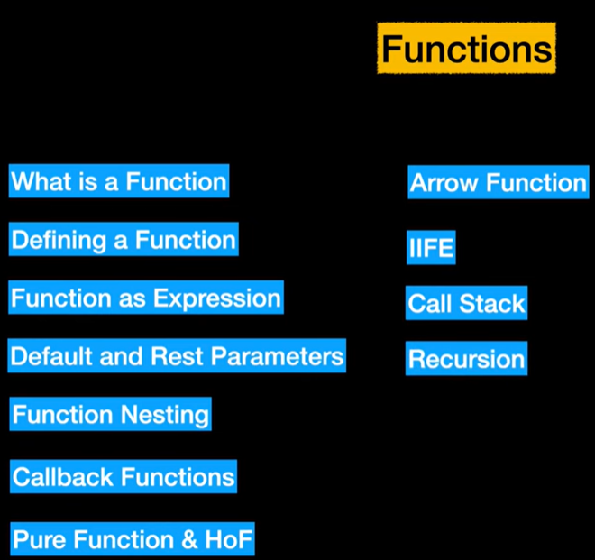

We will not cover

Lines of code which are repeated in execution of code can be made as functions and then called to execute them

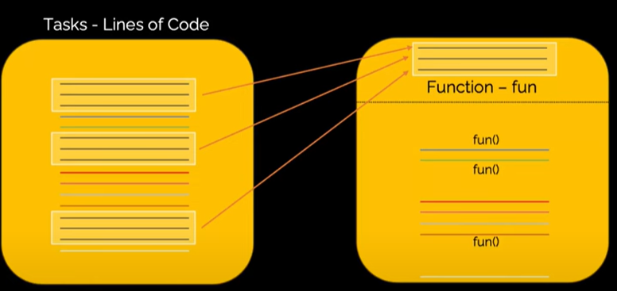

Parameters - are placeholders for inputswhile declaring a function

arguments - are the actual values which are passed during function execution

return value from function to be used anywhere else in the program

return
result; - gives NAN

console.log will give undefined for the result operations

Default parameter
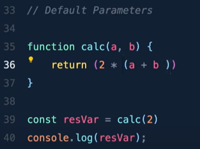

if we do not give a default value, then b's value is NAN and result output will be undefined.

Rest Parameter

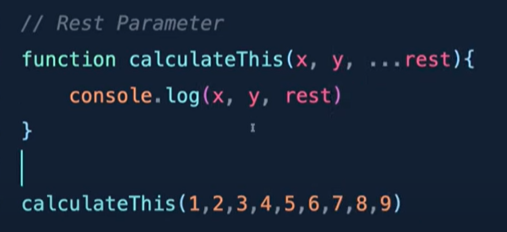

Rest is always at the end, cannot be at first or midddle.

Nested Function - This is a step towards learning closure

Outer Fun -> Inner Fun -> return Inner func when outer executes

callback function - call me after sometime

callback -> promise -> async

Pure Function - useful in component driven architecture in React

provides same output as log as we provide the same input. In cases we will provide the same argument but the output will differ because of certain external factors which makesthe function impure

that means it depends on another variable for ex to get the outcome and if variablechanges the output willchange for same input each time. That is called side effect.

Higher Order Function (HOF)

Take another function as argument or return a function. Useful to create wrappers

Ananymous Fn
 Function with no name

IIFE Fn
Annonymous function which gets executed immediately without calling it. Plugin dev when browser loads, this function executes. ex- get a chatbot or get logo, open whatsapp

Arrow Fn

() =>({})

CallStack - Datastructure of function execution

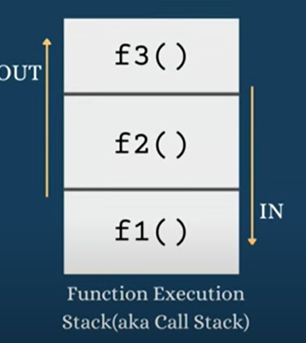

Example with 3 functions

This is simple one where each one gets executed in an order and then gets out of the stack

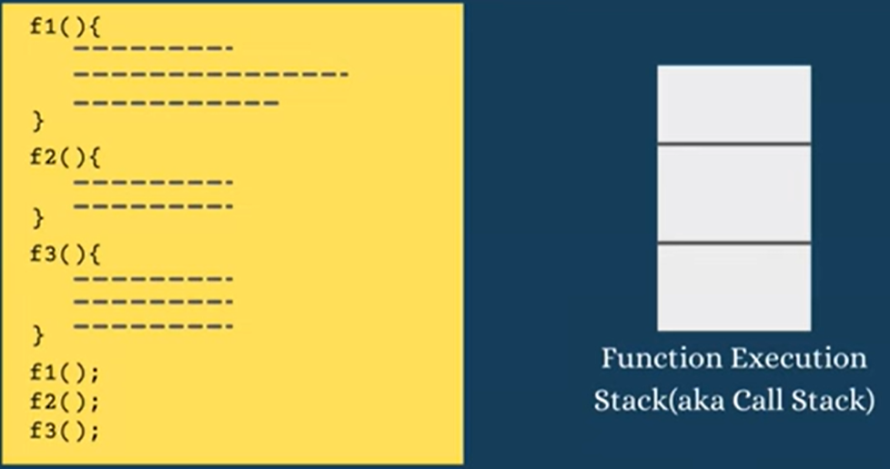

This one
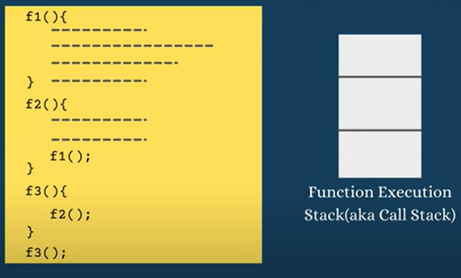

f1,f2,f3

first f1 gets executed and comes out, then f2 and then f3 - LIFO (stack)

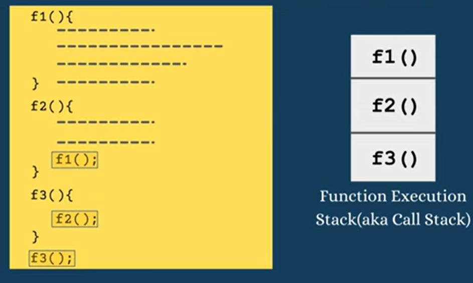

Recursion - Function calling itself

Why do we need this?

It has a cost

It needs to have a base or exit criteria - else max call stack size reached

# Day 7 - Build JS projects

Rock, Paper, Scissors Game develop

Assumptions -

1. Prompt user to get input

2. computer's selection will be random

3. Compare user and computers choice

4. Announce the winner

5. After winner announcement, we can ask the user to play again or quit the game

# Module 2 - Day 8 - Execution Context and call stack

Lexical env - how and where your code is placed, so that JS adheres to JS grammar and converts the code to 
machine language

fun x(){
    var y ="xxx"
}

x();

Placement of variable above

Execution context - Code currently running is managed by JS execution context.

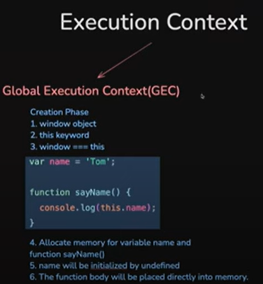
1. GEC -(ex- window is a global object, this keyword is there in global window object this === window)
    Creation Phase
        1. window object
        2. thiskeyword
        3. window === this
        4. Allocate memory for variable name and function in this example
        5. Name will be initialized by undefined
        6. The function body will be placed directly into memory
    Execution Phase
        1. it will assign valueto variable name
        2. function execution will not happen as its not called or invoked
        3. When function is invoked,then we will get FEC - Function Exec context
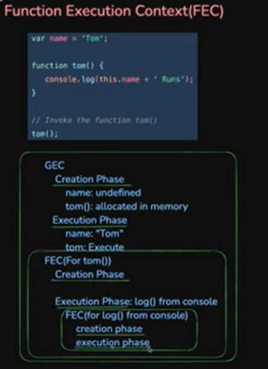

Eample -

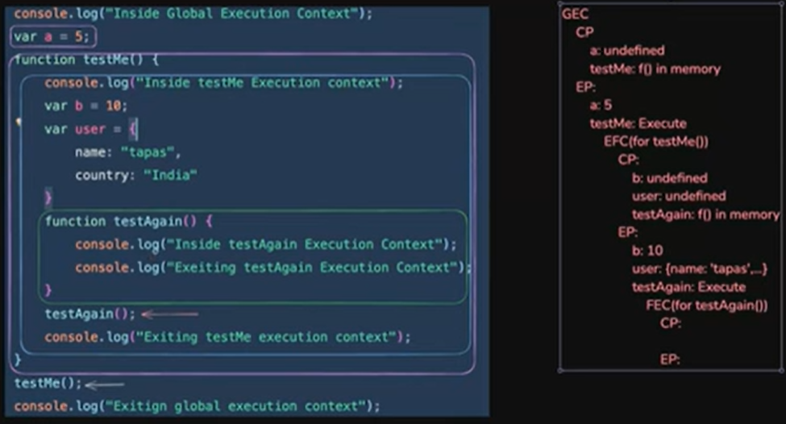
    
Memory structure

1. Stack - primitive
3. Heap - non-primitive

For each of the code line - GEC gets created and so on
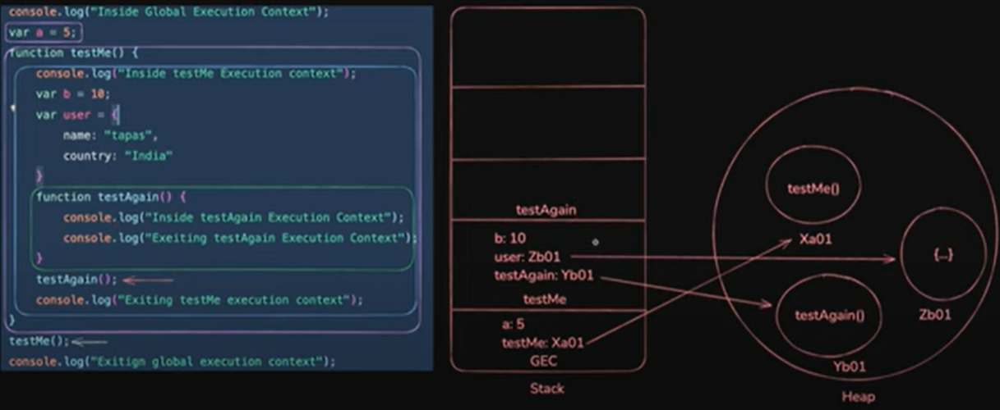

Then stack gets cleared from top and garbage collection comes to picture

Stack clearing
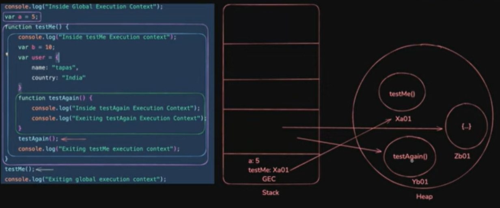

Garbage collection
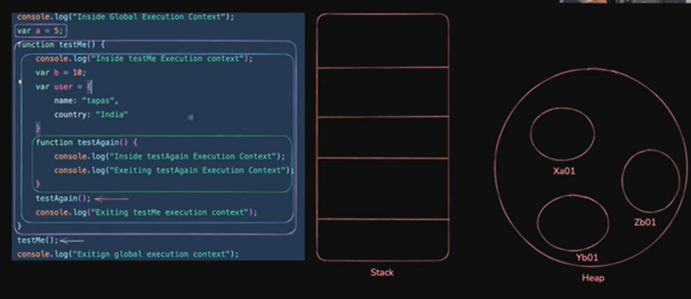

Overall Memory execution

# Day 9 - Hoisting ad Temporal Dead Zone

At exec time JS hoists variable name if it executes before the variable is declared.

JS allocates memory in creation phase and hence value is nothing (undefined)
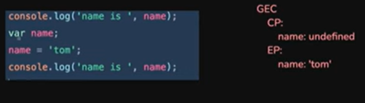

Var is not used for these reasons as we get confused when thevar is declared and when its used. So,we should use
let or const

With let we will get error - cannot access name before initialization. The variable gets created and is not initialized with any value as in case of var. ifit does not have any value or initialization we cannot use it in our program.

With const also we will get error

Temporal Dead Zone - Area where we cannot access a variable until it is initialized.

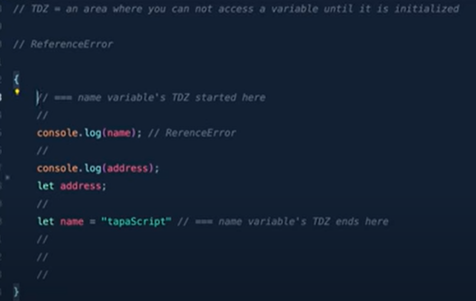

Function hoisting - phase where creating memory for your function is called function hoisting, creating memory for variable and initialization is called variable hoisting

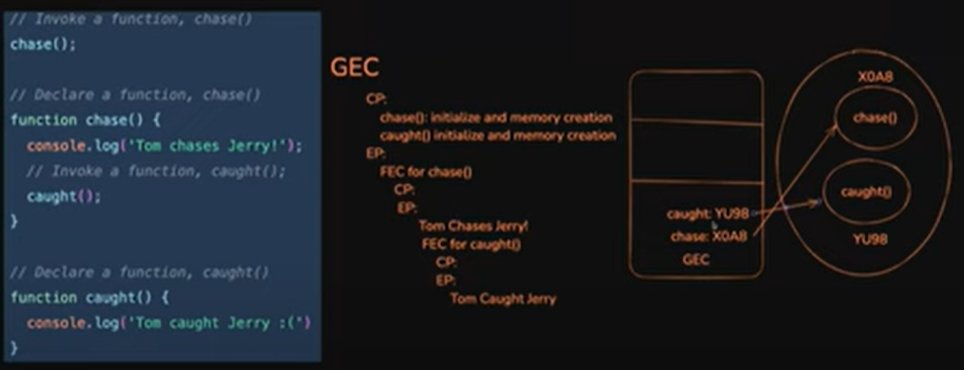

For the following we will get error as here memory is created for avariable test

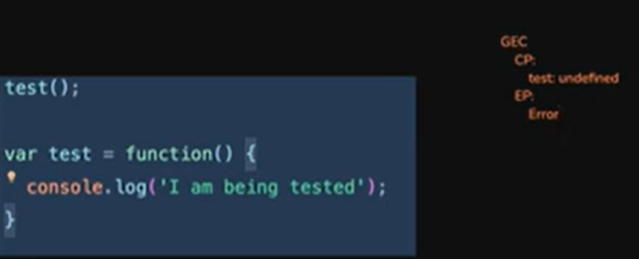

//we will get type error - test is not a function
//because test is undefined at the time of call
//as var is hoisted but not the assignment  
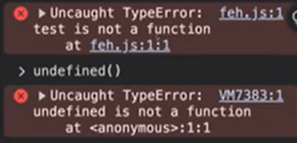

# Day 10 - Scope and Scope Chain in JS

Where a variable is accessible in JS determines the scope of variable. Following are types of scope in JS

1. Global scope 2. Function Scope 3. Block Scope 4. Module Scope

Global - if we declare variable with let, its not added as a property of the window object which is global. With var, it becomes a property of the window object. else let or var declared in global scope can be accessed everywhere

Function scope - variables declared in a function can be accessed within the function and not outside

Block Scope - for, switch, {} , variables declared with let and const cannot be accessed outside but var can be accessed outside

var is function scoped but let and const are block scoped

Scope chain - first JS checks variables at local level, then if it does not find, it goes out and checks above and similarly it checks to find any variables during execution

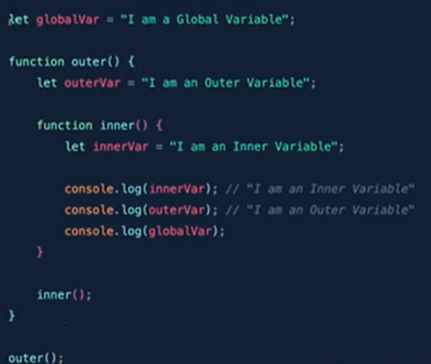

Variable shadowing - its when a variable in inner scope has the same name as in outer scope, so it is shadowing or hiding the outer scope variable with the inner scope variable.

JS prioritizes the variable in inner scope rather than in the outer scope

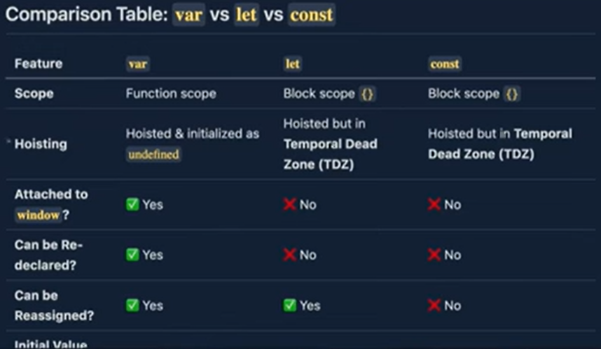

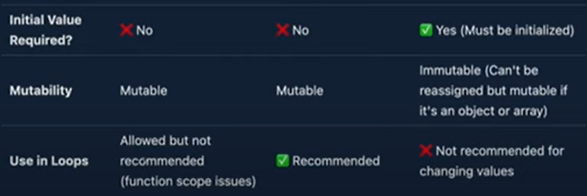

Var should not be used in loops or inside blocks asits accessible in the whole program. Hence, it can be reassigned which might cause bigger issues difficult to troubleshoot. So, let is the best way

# Day 11 - Closure in JS

To learn closure we should have good understanding of inner and outer functions, scope

Vars declared in outer function can be accessed by inner function but vars declared in inner function cannot be accessed by outer function.

Lexical scoping

Closure - inner function has access to outer function's variables even after the outer function has returned
Closure - combination of function and lexical environment within which that function was declared
Closure - gives you access to an outer function's scope from an inner function
Closure - created every time a function is created, at function creation time

We can only return 1 function from a function and cannot return multiple functions. For such implementations to house multiple return for functions we would need to use objects, next session.

closure always holds the reference of a variable declared in outer function. we should not use closure in case of big data as it can result in memory issues and performance.

Example - closure always refers to the reference variable and hence this is not garbage collected,with time this can result in huge problems as memory is not cleaned up

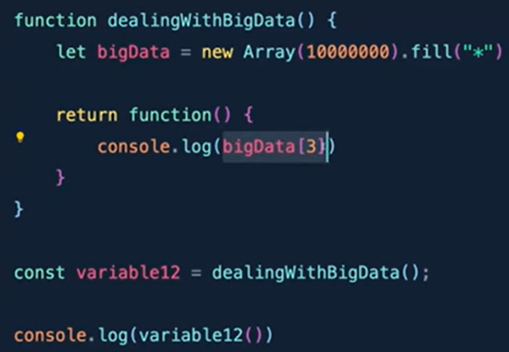

Advantages of closure -

1. We can keep the variable private without exposing it

2. we can stop variable pollution

3. we can make a function factory method

4. We can keep a variable alive in multiple calls as all closure have access to the outer function variable

Lets see in a function timer, like we saw count, bank account before to see its effectiveness

# Day 12 - Objects in JS

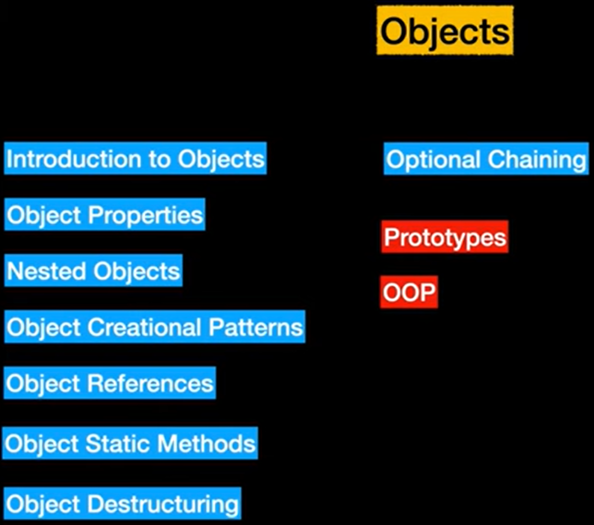

key - value pair in JS. Declared with {}

user.age, user.name

user["is Admin]: true - use subscript for declaring special char vars. Same is used to retrieve

delete user["is Admin] - used to delete theproperty from object

Contructor object gives blue print for car, obnly object literal usedto give key and value

Another way to declare object is using keyword Object

Object - stored in heap as its non-primitive type, uses pass by reference

Static methods in Objects

Object Destructuring - instead of using object.property to get the value we can also use

const {names, age, meal="bread"} = student - this does the same thing. we can also add a new property and add a default value in the declaration.

# Day 13 - this in JS

Global Exec context - this keyword points to window object

Outer function or inner function - this always refers to window function

this in Object refers to the same object

In strict mode - JS does not allow this keyword to refer to window object in a standalone function. The value of this will be undefined always for outer,inner or any other function.

In arrow function this keyword is resolved by the lexical scope which is global and hence points to window object in strict mode

strict mode is used to make JS adhere to JS rules for development and is generally used

this keyword - in global scope, in standalone function, inside standalone function in strict mode, this keyword with implicit binding in object method, this keyword in arrow function,
this keyword in arrow function that is in another function scope or object, this keyword with explicit binding - with call, apply, bind, this keyword with objectcreated with new keyword

# Day 14 - Error Handling in JS

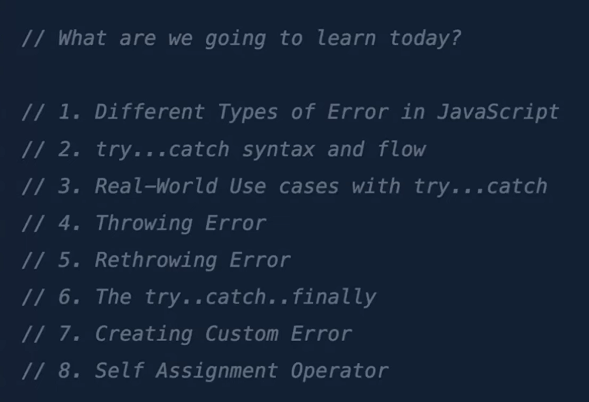

1. parsing error - due to grammar of js, needs to be fixed by fixing the grammar of code
2. Runtime error - needs to be handled to give good experience to end user

Handle errors with try and catch block

try {
    do something with logic and code
} catch(error){
    do something with the error
}

Rethrow - rethrow error from catch

finally - always gets executed (cleanup actions)

# Day 15 - Javascript Array 

Rest - ... in left of operator in variables

Spread - ... in right of operator in values

It is important in programing to manage data changes in an immutable way. That is to make a copy of it and not change the source.

Static Methods - Array.From(), Array.fromAsync()

Arraylike - Htmlcollections, arguments

Iterator fuctions - Filter() - uses test function as argument, map() - uses transformation function as argument - both take callback functions

reduce() - complex method - takes callback function and an optional initial value argument

# Day 16 - Debugging with DevTools

Why is my app not working. Fixing issues with available tools?

1. Using console.log is used by many

2. Breakpoint

3. Programing is 60% debugging

chrome devtools and vscode can be used to debug

# Day 17 - Intro to DOM with JS projects

Tree Structure 

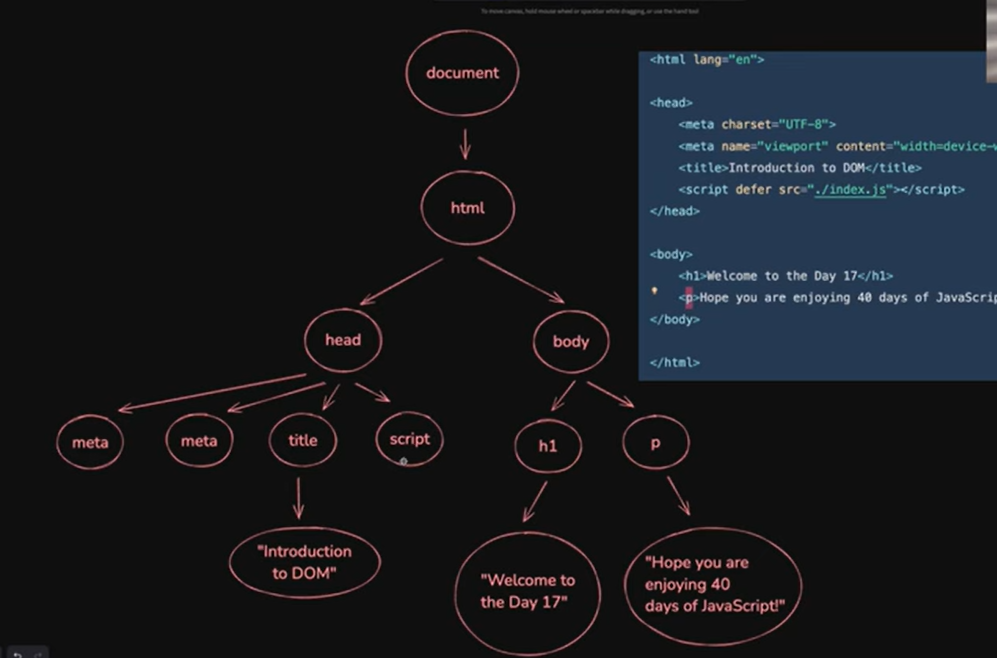

DOM is not a component of JS. JS leverages this to generate dynamic content.

DOM Types - Document, Node, Element, Nodelist, Attr, NameNodeMap

document.head

document.body

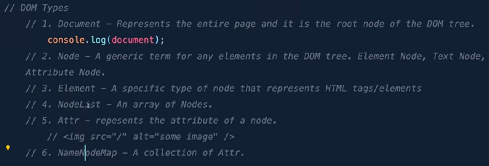

// Accessing DOM

By id - document.getElementbyId("heading")

By class - document.getElementByClassName("info")

By tag Name - document.getElementByTagName("p")

Byqueryselector - document.querySelector(cssSelector)

document,querySelectorAll(cssSelector)

# Day 18 - DOM Manipulations

Create Elements

Insert Elements

Modify Content

Removing Elements

Read, Write and Remove Attributes

Traversing/Navigating OM

Manipulating Styles

Manipulating Classes

className is not a very fleible property to be used as if we have multiple classes in a div and if we want to change only one class, it would replace both with the new one. So, we need to check classList.

Controlling Visibilities

Build Projects

Tasks

# Day 19 - Events in JS

1. Event - Signal that something happened in the browser

2. Event Handling and Why

3. Event Handling in Markup

4. addEventListener and removeEventListener

5. DOM Content Loaded

6. Event Object

7. Event Capturing and Bubbling

8. Event Delegation

9. Event efault Behavior

10. Custom Events

11. Projects

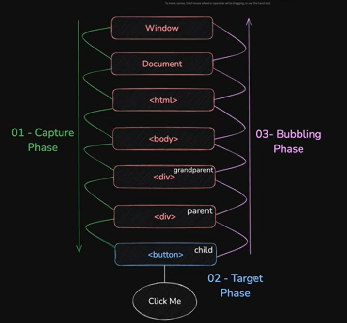

By default bubbling phase is enabled and capture is disabled. We can enable capture phase if we want.

# Day 20 - Advanced DOM Tricks

Parent element

sibling element

child element

Template - creates document fragment and can be cloned to use the same

Documenty Fragment and Range - Not a part of the main DOM tree until we insert it, Acts like a temp container,
Great for building chunks of DOM before adding them.

# Day 21 - Quiz App

- Design

- Develop with features

- Gamification

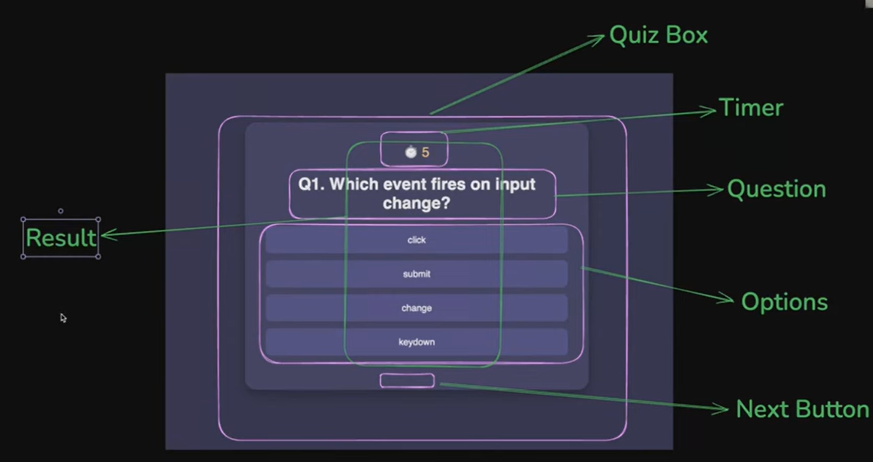

# Day 22 - Callback with Asynchronousprogramming

setTimeout() - waits for time passed before execution, helps with async programming

callback - when we want to execute something before the execution of a function. The callback function helps in these cases by being called from another function.

promises

async/await keywords

EventLoop

# Day 23 - Promises in JS

 What is a Promise in JS? - states of a promise. Online order, Whatsapp message, luggage belt in Airport

    Pending - Initially when the executor function starts execution

    Fulfilled - When the promise is resolved

    Rejected - when promise is not fullfilled and rejected

    Result - 

        undefined - Initially when the state value is pending

        value - when resolve(value) is called

        error - when reject(error) is called

        Promise uses an executor task to complete its task.
         How to handle promises?

 .then(), .catch() and .finally() are the ways to handle promises from the executor service as response

 Callback to Promise

 Understand Promise states

 How Promises are resolved and rejected?

 Handling Promises

 Promise Chain -

 Rule 1 - Every promise gives a .then() handler method. Every rejected promise provides a .catch() handler

 Rule 2 - we can do 3 valuable things from the .then() method. We can return another promise(for async operation).
 or return any other value from a synchronous operation. or throw an error.

 Rule 3 - we can rethrow from the .catch() handler to handle the error later. In this case, the control will go to
 the next closest .catch() handler

 Rule 4 - Unlike .then() and .catch(), the .finally() handler does not process the result value or error. It just passes the result as is to the next handler.

 Rule 5 - Calling the .then() handler method multiple times on a single promise is NOT chaining

 Handling multiple Promises - promise.any, promise.all, promise.

 How to Cancel a Promise

 PizzaHub App

 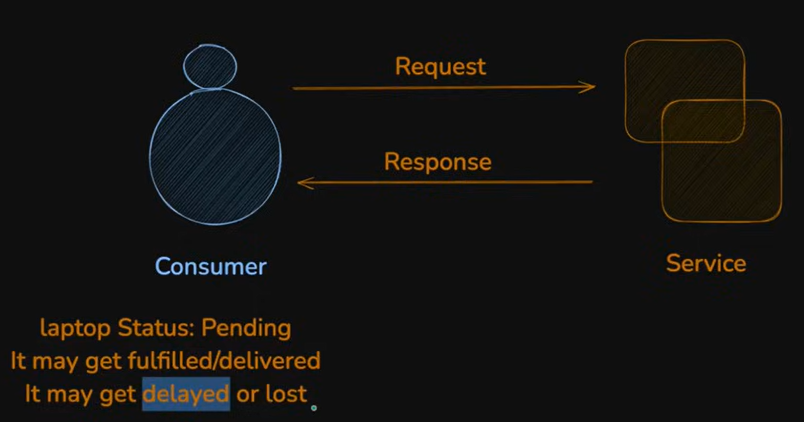

 # Day 24 - Async and Await to simplify promises , last part pokemongo watch again

 Promises: What are the problems? - No issues, just the code structure and the number of lines of code is complex and also difficult
 for devs and for debugging. So, we have async/wait

 Promise to await

 async helps in implicitly returning a promise if promise is not returned. In case, promise is returned explicitly then it will return the same and not return it in a promise wrapper. so, no more promise creation

 after this to handle async, we can use .then and .catch based on how we used to handle promise but if we do not want to use .then and .catch then use await in the handle part

 async function

 async/await together

 Does await make things synchronous

 Error handling with async/await

 Project example

 Top level await

 Multiple async/await

 PizzaHub example with async and await

 async and await can be used with promises to optimize code as needed.

 # Day 25 - Javascript fetch

 What is fetch() API and syntax

 HTTP Methods

 fetch() usage: Getting Resources

 fetch() usage: Query Params

 fetch() usage: Creating Resource

 fetch() Usage: Custom Headers

 fetch() usage: Updating an Entire Resource

 fetch() usage: Updating a part of the resource

 fetch() usage: Deleting resource

 Creating request object

 Handling response

 Handling Errors

 Canceling a request

 # Day 26 - Common Mistakes with JS Promises and Async Code

 Looping with Promises

 do not use for loops to loop in case of fetch calls as it is synchronous. How to solve this problem of not getting data in order?

 we can see if async await helps. Result seems good but is it the right way?

 It seems that we are using async but when the await is used our program becomes synchronous till responses are received. Not that there would be nothing executed after the for loop, that executes as the main thread is not blocked but inside the loop it would be synchronous.
 So, if we have 4 promises and want to hndle these concurrently and not worry about when each of the promises are getting settled, do not use for loop. Use promise.all or few other apis in JS

 # Day 27 - How your Async code works - Event Loop simlified

 Asynchronous and single threaded

 Event loop is most important in JS and has few mathematical formulas which would help in understanding. Pre-requisite for Event Loop -

 1. How JS function works

 2. How callback works

 3. How setTimeOut works andhow promises work

 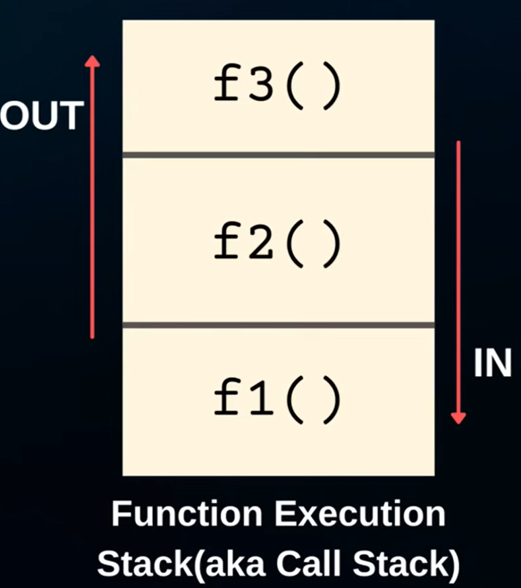

sequential execution

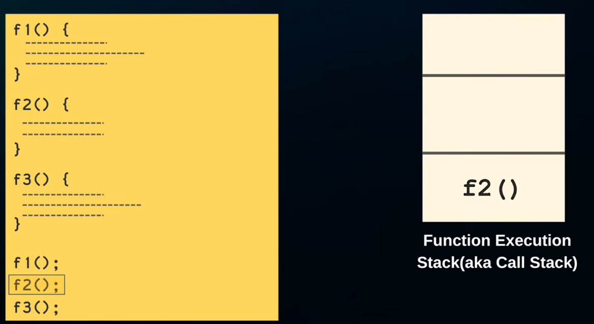

little complex execution - synchronous scenario

Javascript is synchronous. There can be async behaviors. With browser APIs/Web APIs - setTimeout, setInterval, With Promises, With Event Handlers. So, these all functions enter the call stack how would be the behavior as synchronous behavior of JS might freeze the UI. Event Loops help here along with call stack, web APIs, callback queue, microtask queue/job queue, event loop is the one which manages what to run next in the call stack

architecture - Event loop iterates to check if call stack is empty and then checks the callback queue to pull the job to call stack so tht that function can get executed. callback is a function and call stack also is a function where callback function gets executed. Callback queue uses FIFO.

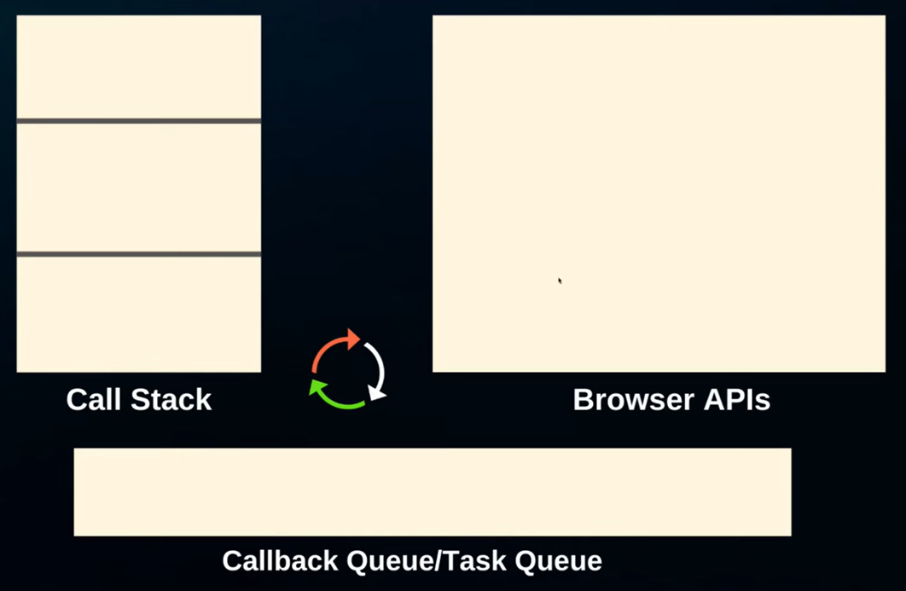

Browser APIs - temp storage for browser apis or web apis

callback queue - temp storage for task, queue

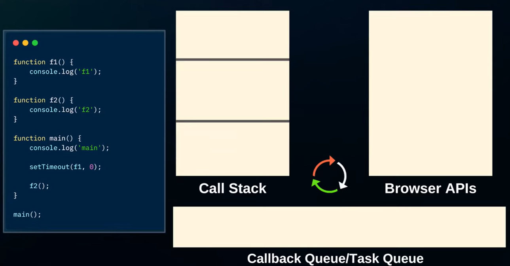

setTimeout is the only callback function here to be hndled

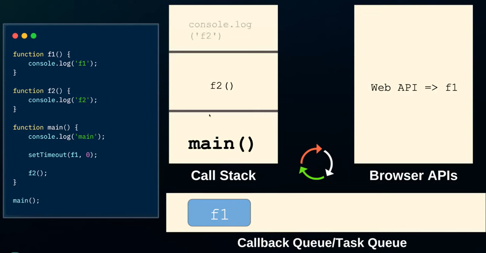

main -> f2 -> f1

f1 goes to callback queue nd setTimeout goes to browserAPI

Example with promises - promises are also a callback as part of the handler fuction. Promise handler would be stored in the jobQ/Micro tasks queue

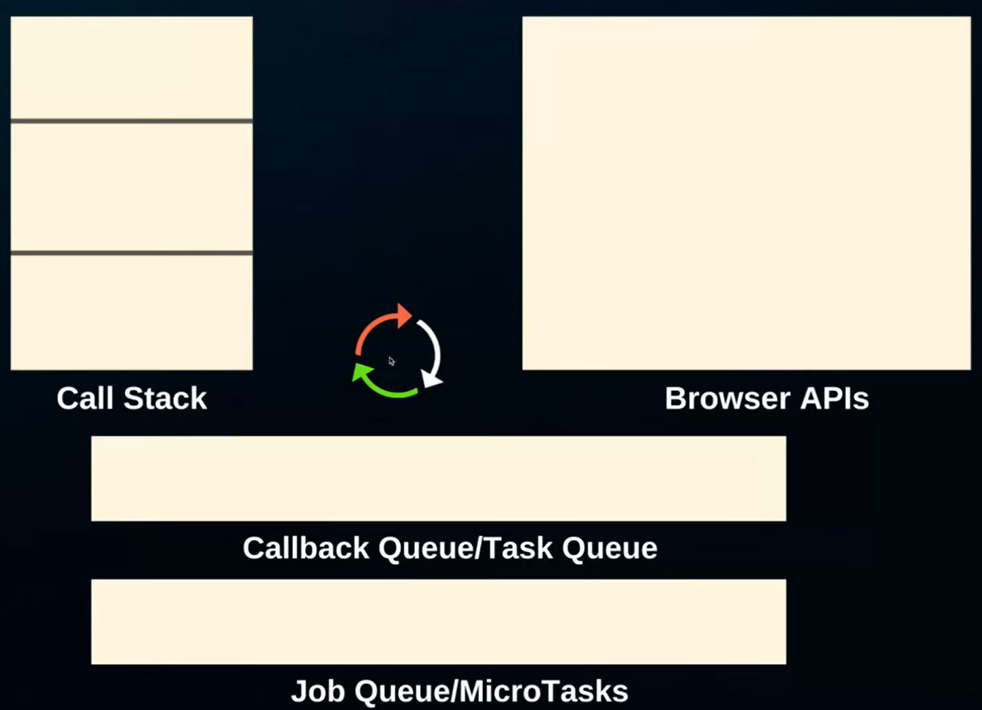

Event Loop gives priority to Job Queue if we have callbacks available i callback queue and JobQ.

What if there are multiple items in callback queue and multiple items in job queue? what happens?

All jobs in jobQ get executed first and then callbackQ gets executed.

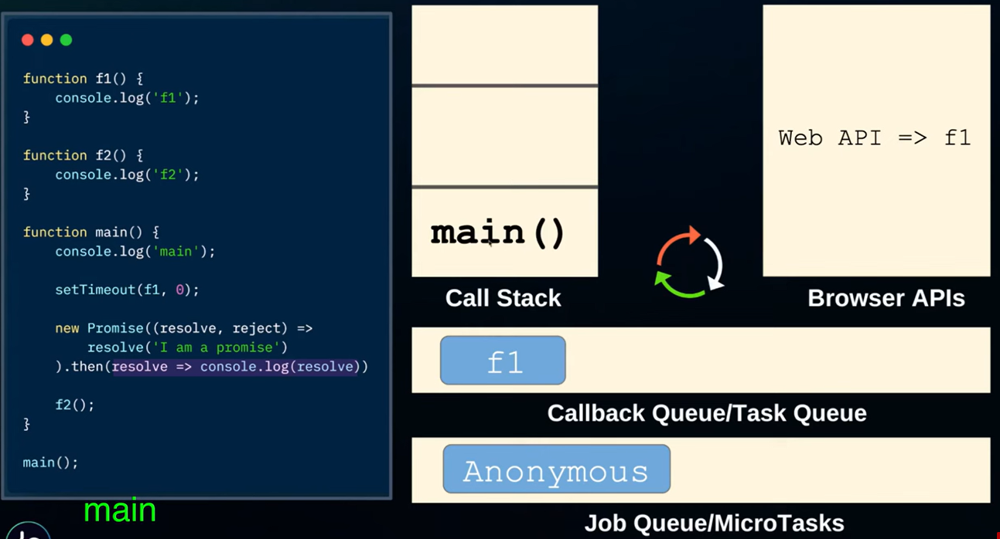

main -> f2 -> i am a promise ->f1

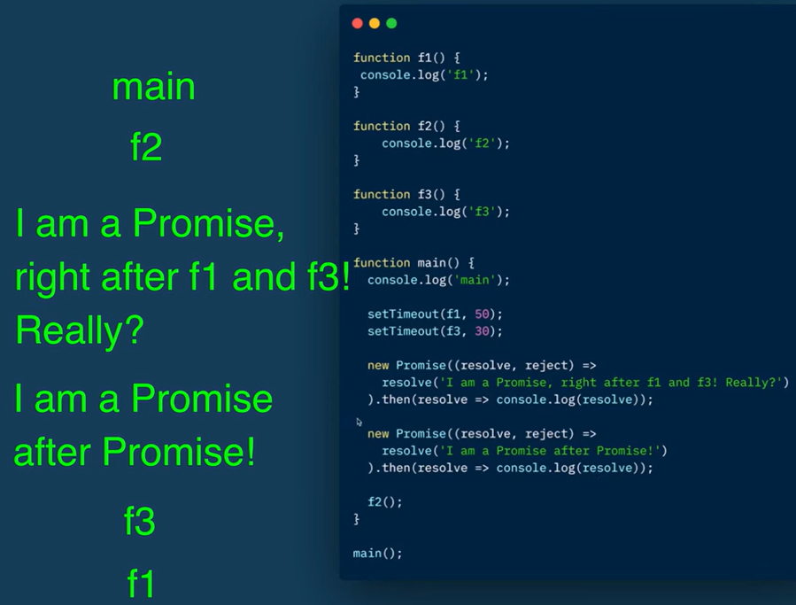

# Day 28 - Build a country app with Async JS and tailwindCSS

We need to build the following project with the layout shown

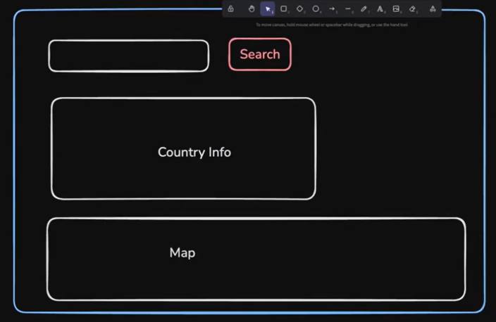

# Day 29 - Object Oriented Programing

What are Objects? - has characteristics -> or properties or attributes or state

Behaviors are methods or actions

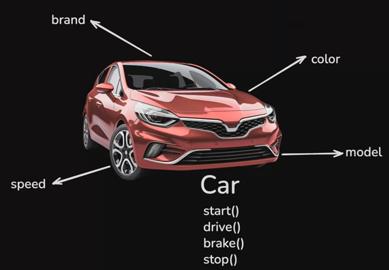

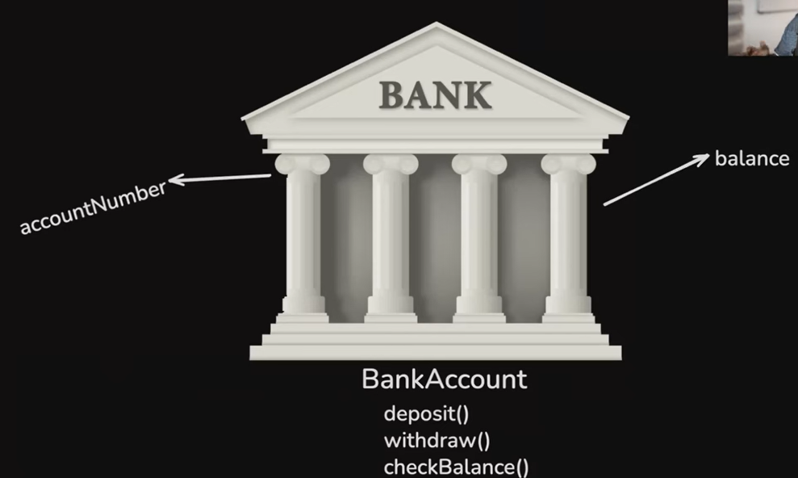

What are Classes? - Blueprint - plan for creating something which is an object. here house is an object, basically its the design.

What are Functions?

How can you practically thik of Classes and Objects?

What is OOP?

Why OOP is important in Programming?

Real-World use cases of OOP

Five key OOP principles:
    Abstraction - hide internal complexities of the system and show just what is needed. In this case remote. Similarly coffee machine, washing machine.
    
    - is abstrcted + is shown to user
    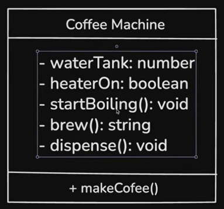

    Focus is on what an object does

    Encapsulation - ATM machine - properties, methods bundled and restricted from access by others

    Focus on how the object protects itself.

    Data and methods are bundled and restricted for anyone to access or perform any manipulations.
    balance is private
    methods are public methods

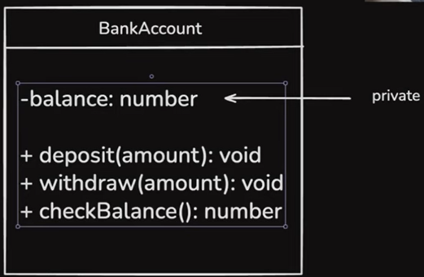

    Inheritance - allows one class to reuse the properties and methods of another class. reduce duplication and promote reusability (DRY)- car is a vehicle, bus is  vehicle
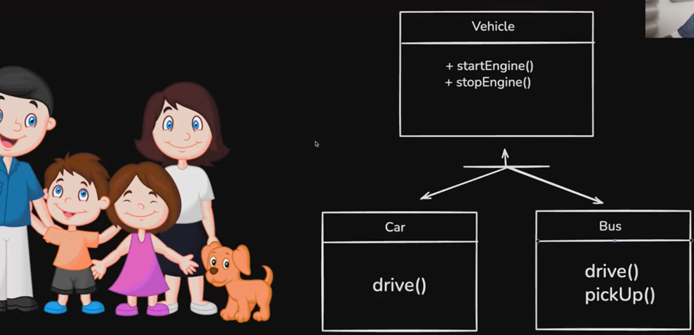
    is a, has a

    Polymorphism - RUN - based on a context it will do something for RUN and another context will perform another activity

    same method, action, command ut behaves differently in different context. override method in the parent to perform a different action
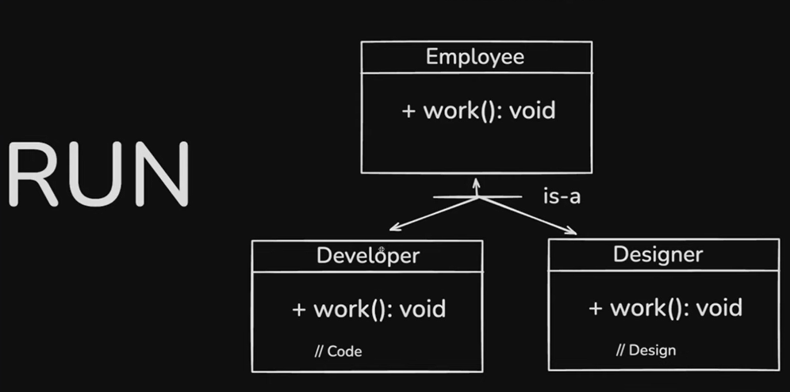

    Composition - compose certai things together where each component can perform a particular role independently.

    music system, Engine - replace any part without changing the whole system in a car

    Composition is a design principle where once class contains or is composed of one or more objects of other classes to reuse their functionality, instead of inheriting from them.

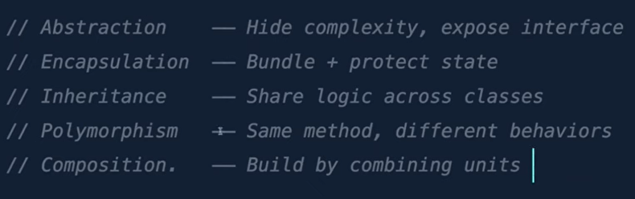

# Day 30 - OOP with ES6 - code files in Day29 folder

Classes was introduced in ES6 of Javscript. Before this there was no class and only way it dealt with objects was via constructor functions.

What is a Class? - Blueprint, plan which is used to create objects

Syntax

Initialize the Object

Class as Expression

Class Fields

Getters and Setters

Static Properties

Private andPublic

Extending

OOP with Classes

# Dy 31 - Javascript Prototypes and Object Patterns

Once we understand object and object creation patterns, prototype automatically comes to picture.

Object inside another object - Composition

Prototype - base structureof the constructor object and each prototype also inherits from base or parent prototype object
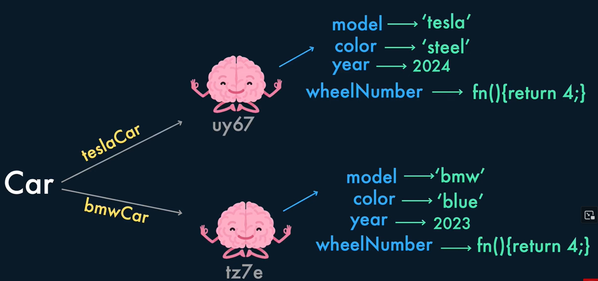
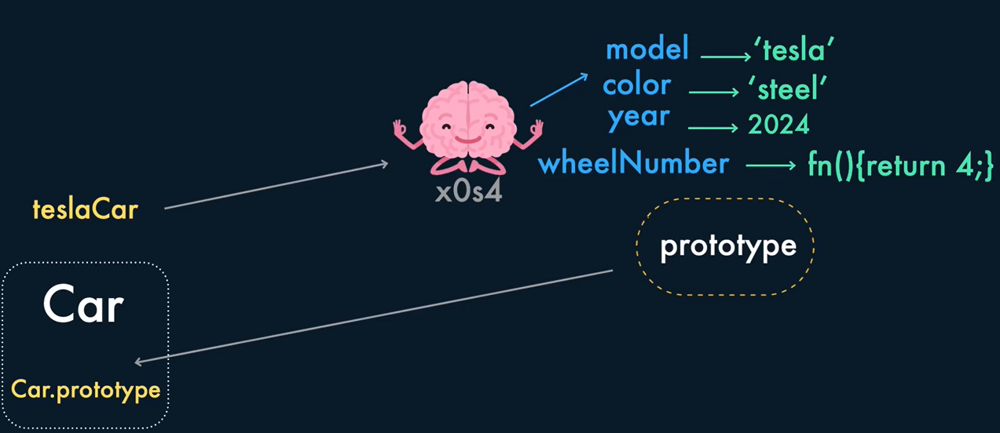

Wheel Number in car prototype

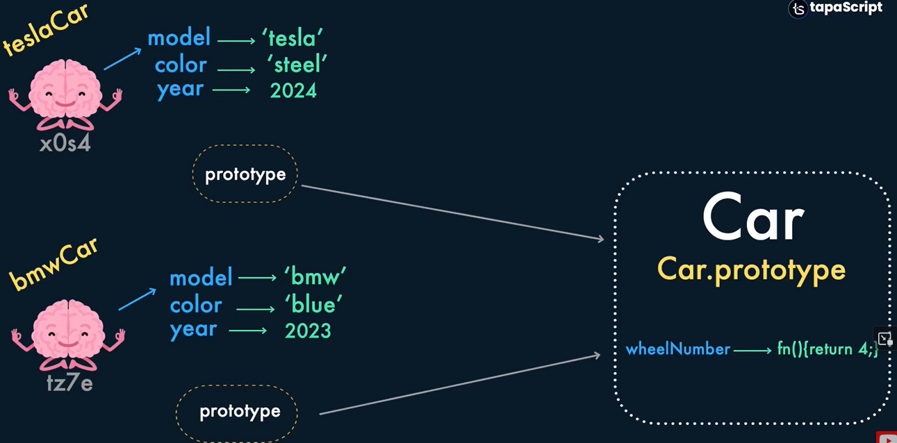

Wheel number can be added as a function in the prototype and not in the constructor and hence constructor and prototype would be available under prototype. How it helps is, its just part of the car prototype and not represented multiple times as part of the constructor as all cars have 4 whees as part prototype which is via reference

reference in car prototype

no reference - so undefined
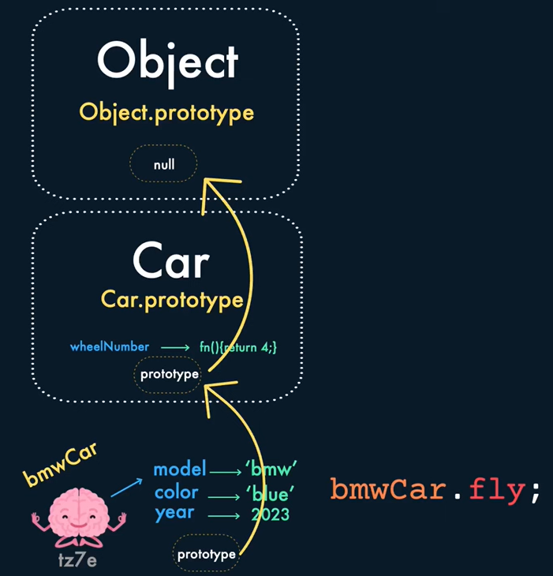

# Day 32 - JS Modules, import, export and Organize

Imagine you have a gigantic js file, no one likes it. Instead you would like to have module_1.js, module_2.js and so on and use these.

Import and Export

named export /import - use same name in export and import file

default export/import - 

used in case of react, where we export only one component from a file. If multiple functions are there and multiple exports then named export/import is used. name is not an issue in case of default export/import

Module Aliases

If there are 2 files (modules) exporting same name, then we would need named export and aliases helps in this case.

import {sum as add, sub} from './calc.js'

namespace - used when we have multiple things to import

import * as calc from './calc.js'

calc.sum

combined import and export - in case we have 10 modules

create an imtermediate file then write the export statements, then import the intermediate file

import * as xx from'./intermediate.js'

xx.calc.sum(1,3) - in case of calc namespace

else if default, we can directly access

Dynamic Imports - can be used at any place in code and not only at the top

const {sayHi, sayHola } = await import('./greeting.js');

Load multiple modules concurrently

const promises = Promise.all(
    [await import('./greeting.js'), 
    await import('./calc.js)
    ]);

promises returns 2 arrays here, if more imports then more arrays

Tree shaking - import lot of stuff and all not being used.so its like lot of module in bundle. Removing the unused modules and only importing what is needed is called Tree Shaking.

