# Day 1 - Introduction

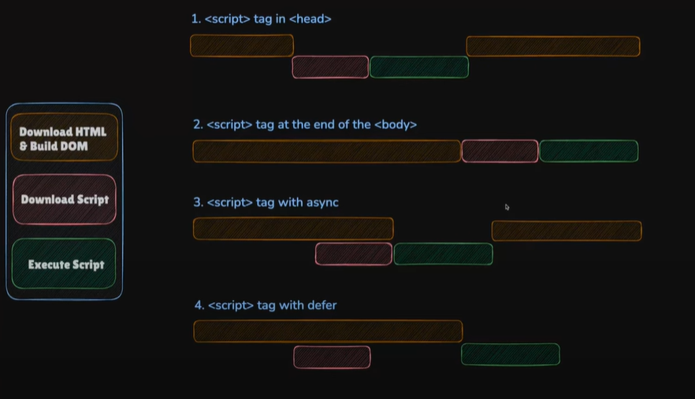

Use JS in html
- Script tag preferred with js file

Browser downloads and executes html and prepares DOM, then downloads scripts and then executes the script. If script gets downloaded fast and html execution is still in progress, we get errors as we might not have reach the declarations in html.

Ex - script tag is in head which performs an activity on a variable

HTML execution is in progress while script execution starts but it fails as it could not find the variable during execution by the browser.

For this we add script tag at the end of body in html or we can use async (used for third party libraries which needs to be download on the background) which will solve the issue but not completely  and then defer which will wait to execute the js only after the html executes all the lines.

# Day 2 - Variables

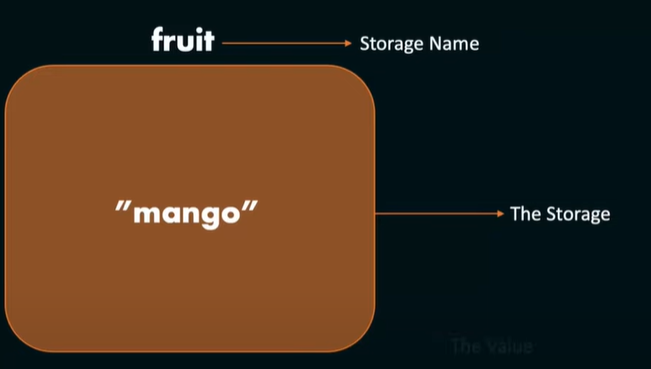

specifiers - control the scope of variables and how many times it can be changed. 

let

const

let/const storage_name = value

let fruit = "mango"

= assignment operator

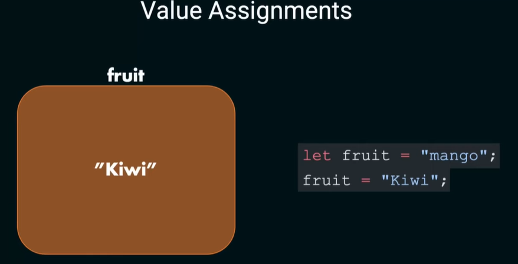

reassign variable has the new value

Value Assignment

Pass by value
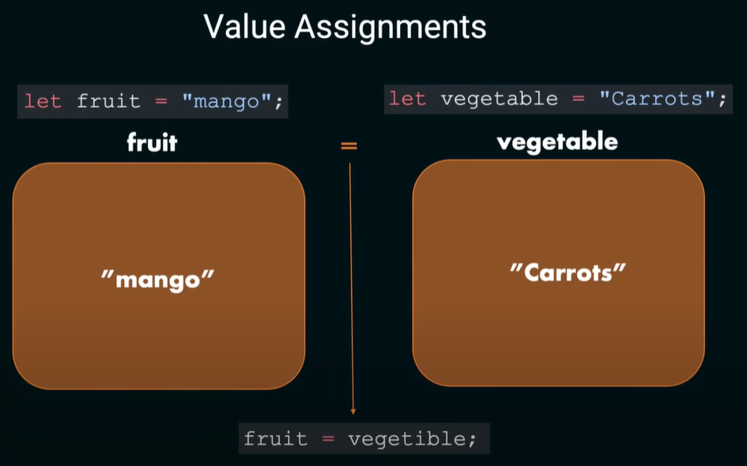

Primitive (pass by value) data types - num, string, boolean, undefined, null, BigInt, Symbol

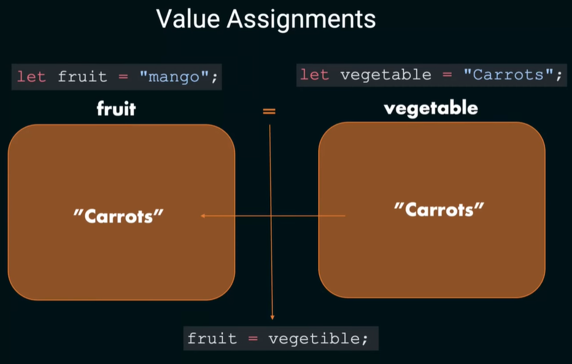

Non-primitive data types - function, array, object

Rules for naming variables -

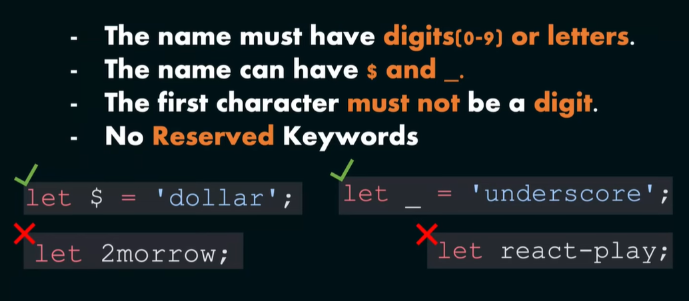

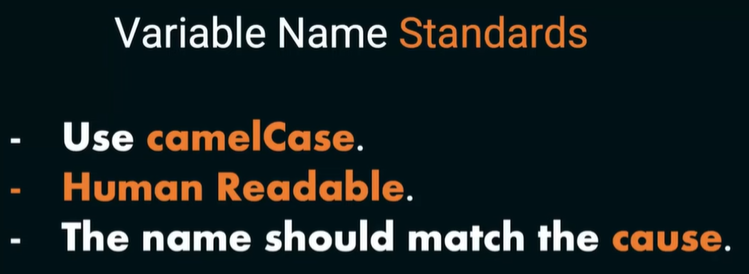

var: Function-scoped, can be redeclared (not recommended)

let: Block-scoped, can be reassigned and cannot be redeclared

const: Block-scoped, cannot be reassigned

Declare variables only once and assign value multiple times based on use case.

Primitive variables are stored in stack and non-primitive in heap. Each location has an address with with the item in stack can get the value from heap by pointing to the address. 

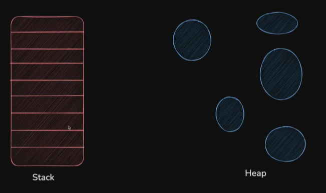

JS performs the following for each line of code -

- Tokenizing - Break line in to pieces/tokens to validate grammar of JS. 

- Parsing - Tree structure with Abstract syntax tree with all the tokens where in each node tokens will be there and definitions
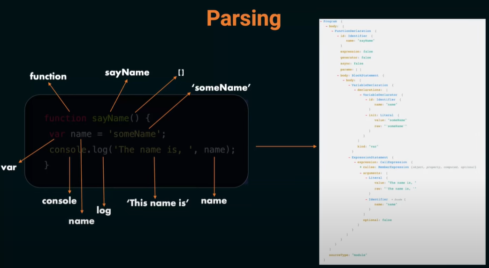

- Interpreting - Machine learning code

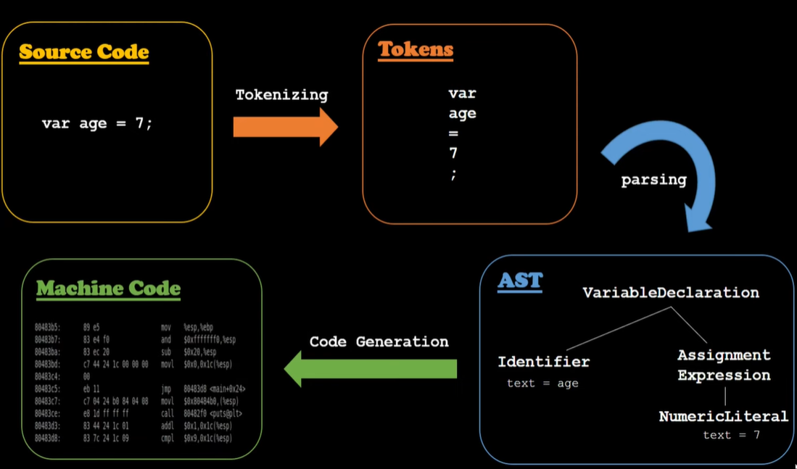

Everything we write in JS gets converted to AST.

# Day 3 - Logic building first steps - Operators and Expressions

// Operator - + - * / % ++ --

// Comparison Operator - == (only checks value) === (strict equality - checks type) != !== > < >= <=

// Logical Operator - && || !

// Bitwise Operator - & | ^ ~ << >> >>>

// Ternary Operator - condition ? true : false

// Assignment Operator - = += -= *= /= %=

// String Operator - +, +=

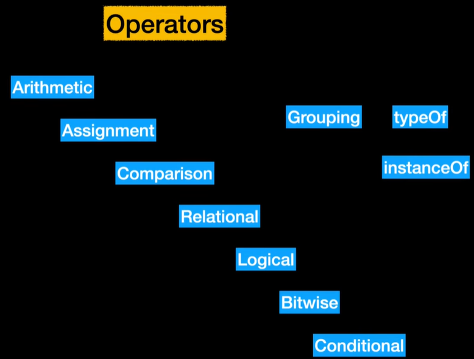

coalescing operator - first value is returned if it is not null or undefined, else second value is returned

Bitwise Operator

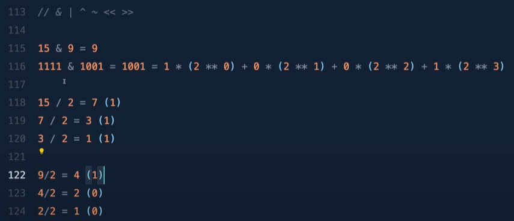

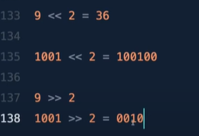

Relational Operator - in, instanceof

Grouping - takes higher precedence in BODMAS

console.log((p + q) * r)

typeof - returns the data type in JS

# Day 4 - Control flow in JS

Control flow of execution rather than line by line. We needto control the flow by using if, if-else, switch-case, break, continue

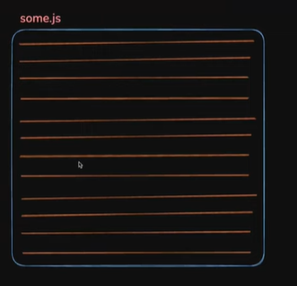

if-else is not suitable for more cases and we use switch case for multiple cases.

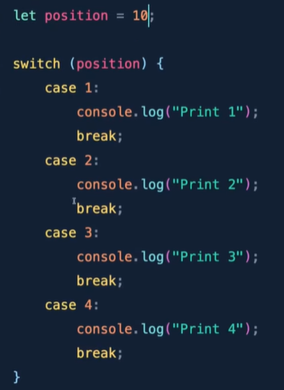

above - no case matches, hence use default

default:
    console.log("Nothing is matched")

If-else is sequential but in switch JS forms a table and directly goes to the matching case. So, it is performance efficient.

complex logical conditions - If-else is the way and if some basic matches to be done its switch case

Ternary case - 
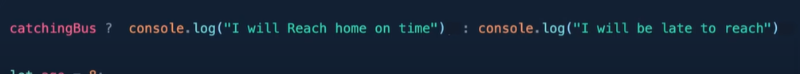

Example
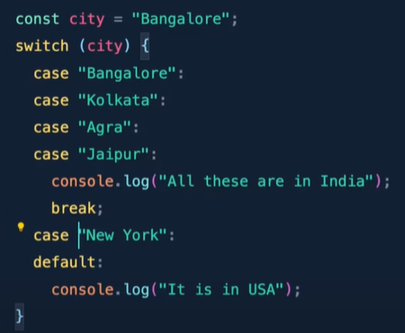

Answer is - All these are in India and then break gets executed

# Day 5 - Lpps and Iterations in JS
